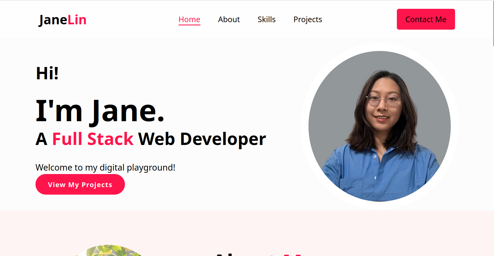
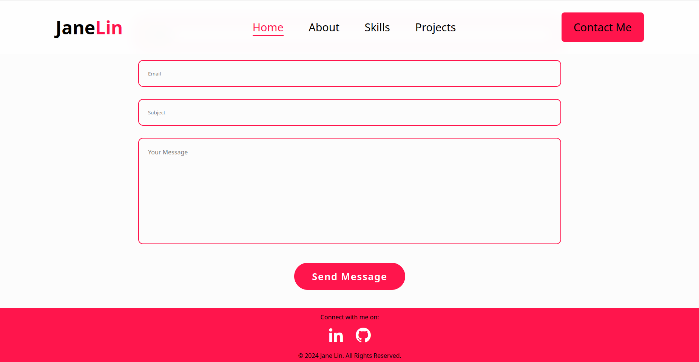
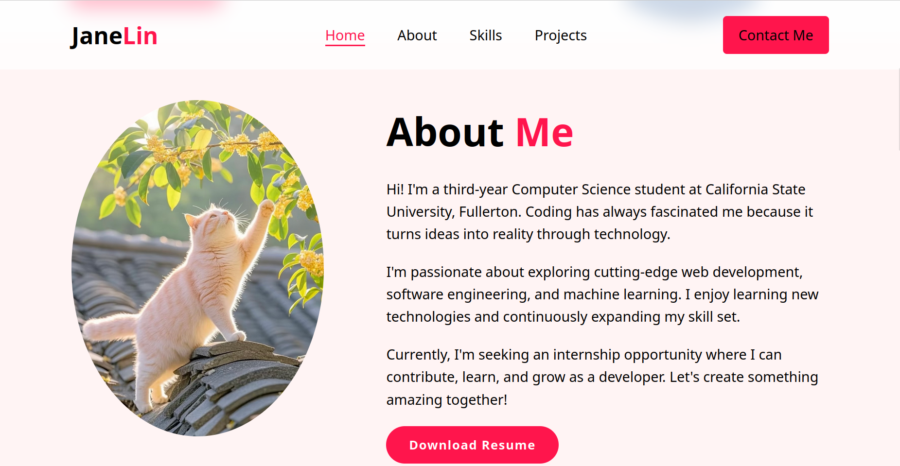
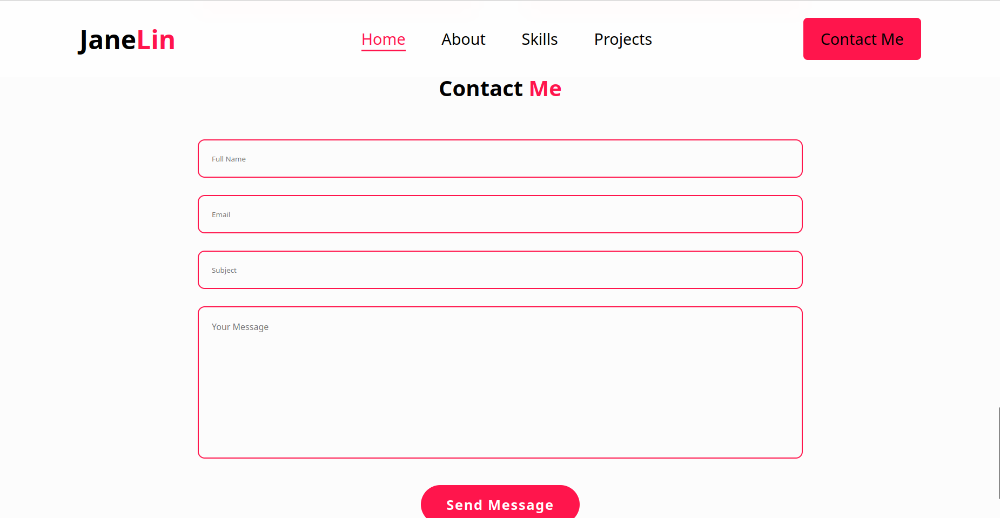
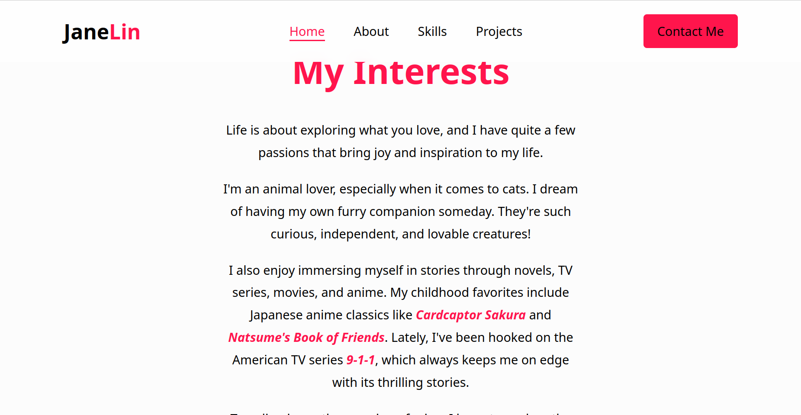
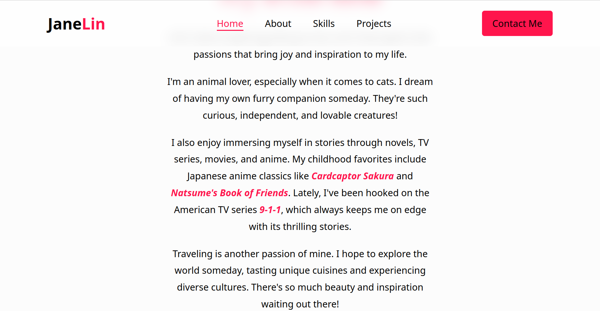
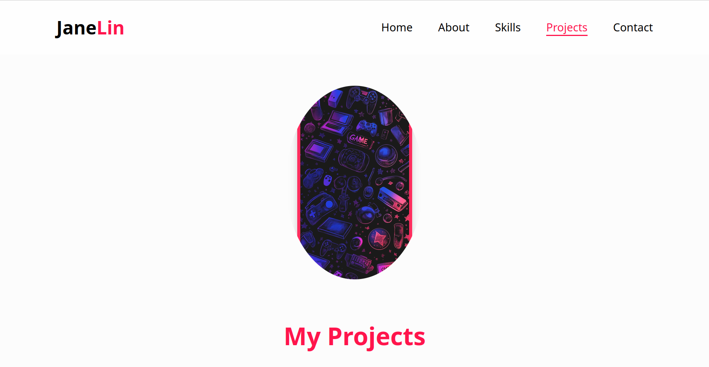
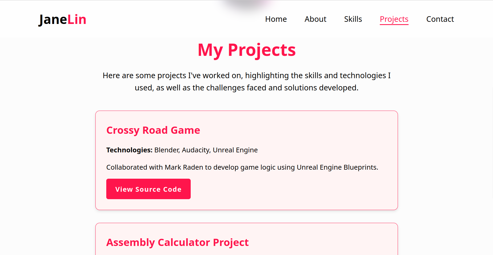
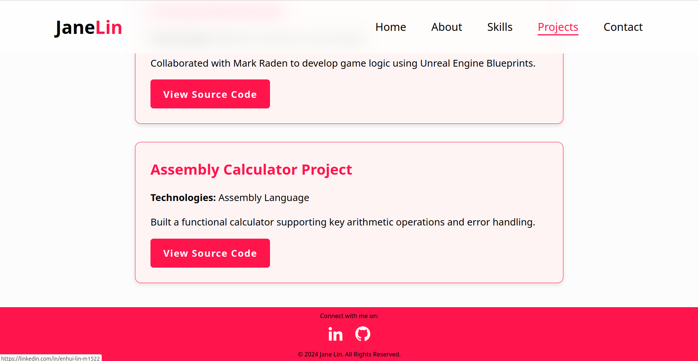
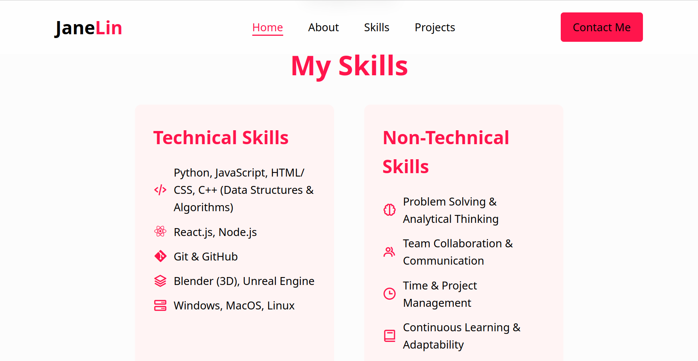

# Personal Portfolio Website

A responsive personal portfolio website to showcase my skills, projects, and contact information.

## Screenshots

### **Homepage**

### **About Page**

### **Contact Page**

### **Interests Section**

### **Projects Page**

### **Skills Section**

## Features
- 📄 **Home Page**: Introductory bio and professional photo.
- 👩‍💻 **About Page**: Detailed background, skills, and interests.
- 🛠 **Projects Page**: Showcasing projects with descriptions and links.
- 🧑‍🎓 **Skills Section**: Categorized technical and non-technical skills.
- ✉️ **Contact Form**: A functional form to send messages directly to me.
- 📱 **Responsive Design**: Works seamlessly on all devices.

## Technologies Used
- HTML
- CSS
- JavaScript
- 
## How to Run
1. Download Live Server on VScode
2. After installed Live Server, right click the file to open with Live Server

